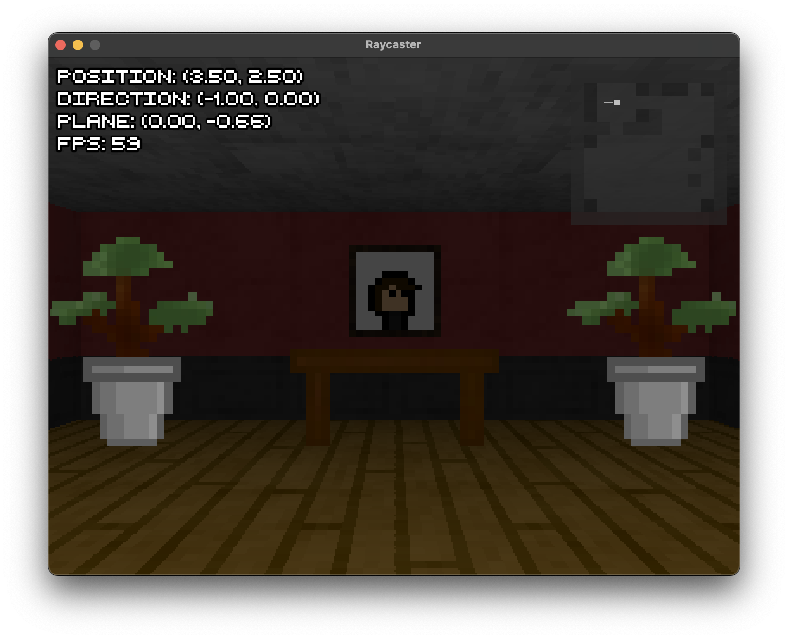

# SFML Raycaster

This project is an implementation of the raycasting technique used in classic games like **Wolfenstein 3D**, developed using **C++** and **SFML**. It simulates pseudo-3D environments on 2D grid maps, combining efficient rendering with modern input handling and customizable levels.



## Features

- Pseudo-3D rendering with raycasting.
- Smooth player movement, rotation, and strafing.
- Real-time UI: position, direction, plane, and FPS.
- Mini-map for navigation.
- Customizable levels with textured walls and objects.

## Controls

- **`WASD`**: Move and strafe.
- **`Arrow Keys`**: Rotate the view.
- **`Esc`**: Exit.

## References

Special thanks to:
- [Lodev's Raycasting Tutorial](https://lodev.org/cgtutor/raycasting.html)
- [ws-kj/raycaster GitHub Repository](https://github.com/ws-kj/raycaster)

## Build and Run

1. Install dependencies (**SFML**).
2. Build the project using CMake:
   ```bash
   mkdir build
   cd build
   cmake ..
   make
   ```
3. Run the executable:
   ```bash
   ./Main
   ```